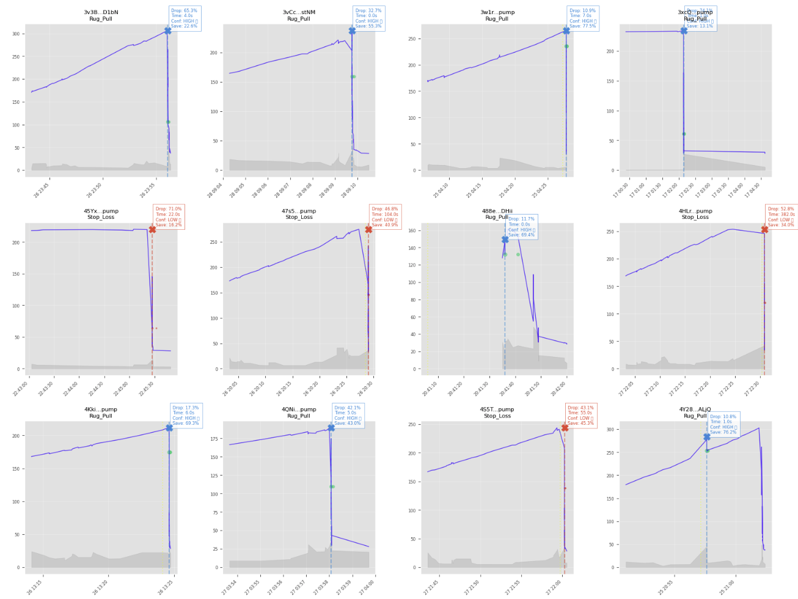
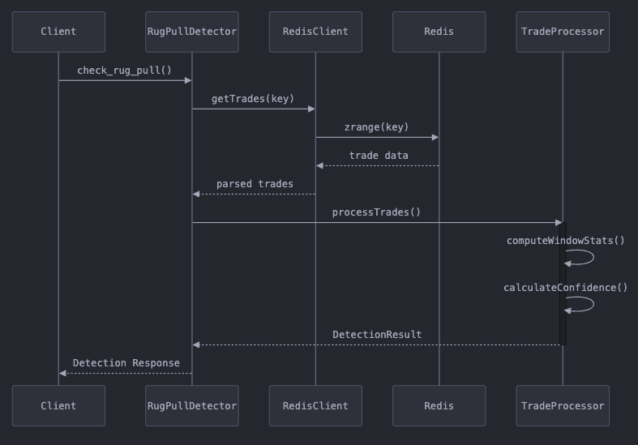
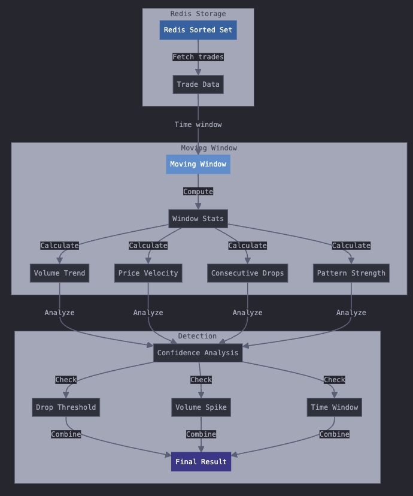
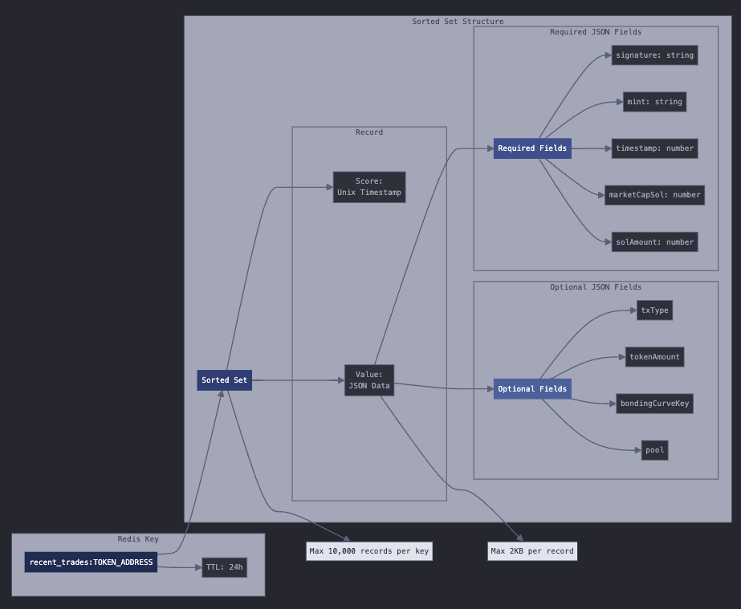

# RugPull Detector


A high-performance, real-time rug pull detection engine for cryptocurrency tokens. Written in modern C++ with Python bindings, this tool helps protect traders and investors by identifying potential rug pulls through pattern analysis and market behavior monitoring.

## Detection Examples

Here are some examples of the detector identifying rug pulls in real-world scenarios:



## Features

- **Real-time Detection**: Monitor token trading patterns and detect potential rug pulls as they happen
- **High Performance**: Written in C++ with multi-threading support and SIMD optimizations
- **Multiple Interfaces**: Use via C++, Python, or CLI
- **Moving Window Analysis**: Adaptive time window analysis of trading patterns
- **Configurable Parameters**: Customize detection thresholds and sensitivity
- **Production Ready**: Built with reliability and scalability in mind

## System Architecture

The system consists of three main components working together to provide reliable detection:

### 1. Detection Process

The detection process follows this sequence of operations:



### 2. Analysis Algorithm

The moving window analysis processes trade data through multiple stages:



Key metrics monitored:

- Price drops from peak
- Trading volume spikes
- Market cap changes
- Time-weighted pattern analysis
- Consecutive price movements

### 3. Data Structure

The system uses Redis sorted sets to store and process trading data. Each token's trading history is organized as follows:



#### Redis Schema Requirements

```
Key: recent_trades:<token_address>
TTL: 24 hours
Type: Sorted Set
Score: Unix timestamp (e.g., 1739184338.633)
```

Required JSON fields in each record:

```json
{
  "signature": "5PEnuUTTiqyEoeXtSdFPC38pY1bFCXFAFXKq52WQBCUPzC8sJLhxNDxPDB9YBrQWZDxB6GTzJcPKH399ZpwUP1LY",
  "mint": "14k7LpDRKvyVuMWfGe1vB5ByoQh1yUQPetApMBLuzw1f",
  "timestamp": 1739184338.6333098,
  "marketCapSol": 28.028628070587033,
  "solAmount": 0.001014365
}
```

Storage constraints:

- Maximum 10,000 records per key
- Maximum 2KB per record
- 24-hour retention period

For detailed Redis specifications, see [REDIS_SPEC.md](docs/REDIS_SPEC.md).

## Installation

### Prerequisites

System requirements:

- C++ 20 compiler (GCC 10+, Clang 10+, or MSVC 2019+)
- CMake 3.10+
- Python 3.8+ (for Python bindings)
- Redis 6.0+

Library dependencies:

```bash
# Ubuntu/Debian
sudo apt-get install -y \
    libhiredis-dev \
    libredis++-dev \
    nlohmann-json3-dev \
    libspdlog-dev

# macOS
brew install \
    hiredis \
    redis++ \
    nlohmann-json \
    spdlog

# Windows (using vcpkg)
vcpkg install \
    hiredis:x64-windows \
    redis-plus-plus:x64-windows \
    nlohmann-json:x64-windows \
    spdlog:x64-windows
```

### Build from Source

1. Clone the repository:

```bash
git clone https://github.com/yourusername/rugpull-detector.git
cd rugpull-detector
```

2. Install Python dependencies:

```bash
# For basic installation
pip install -r requirements.txt

# For development setup (includes testing and documentation tools)
pip install -r requirements-dev.txt
```

3. Build and install:

```bash
# Create build directory
mkdir build && cd build

# Configure with CMake
cmake ..

# Build (use appropriate -j flag for your CPU)
make -j$(nproc)

# Install
sudo make install
```

4. Verify installation:

```bash
# Run tests
make test

# Check CLI tool
rugpull-detector --version
```

### Python Package

Quick installation via pip:

```bash
pip install rugpull-detector
```

### Development Setup

For development work, we recommend setting up a virtual environment:

```bash
# Create virtual environment
python -m venv venv

# Activate it (Linux/macOS)
source venv/bin/activate
# or (Windows)
venv\Scripts\activate

# Install development dependencies
pip install -r requirements-dev.txt

# Install pre-commit hooks
pre-commit install
```

### Docker Installation

1. Using pre-built image:

```bash
docker pull yourusername/rugpull-detector
docker run -d -p 6379:6379 yourusername/rugpull-detector
```

2. Building locally:

```bash
# Build image
docker build -t rugpull-detector .

# Run container
docker run -d -p 6379:6379 rugpull-detector
```

### Common Issues

1. **CMake can't find Redis++**

   ```bash
   # Ubuntu/Debian
   sudo apt-get install pkg-config
   export PKG_CONFIG_PATH=/usr/local/lib/pkgconfig:$PKG_CONFIG_PATH
   ```

2. **Missing Python.h**

   ```bash
   # Ubuntu/Debian
   sudo apt-get install python3-dev
   ```

3. **Compiler can't find libraries**
   ```bash
   # Add library path
   export LD_LIBRARY_PATH=/usr/local/lib:$LD_LIBRARY_PATH
   ```

## Quick Start

### Python Usage

```python
from rugpull_detector import check_rug_pull

# Async usage
result = await check_rug_pull("TOKEN_ADDRESS")

if result["rug_pulled"]:
    print(f"Rug pull detected at {result['timestamp']}")
    print(f"Confidence: {result['debug_info']['confidence']}")
    print(f"Drop from peak: {result['debug_info']['drop_percentage']}%")
```

### CLI Usage

```bash
# Check a specific token
rugpull-detector TOKEN_ADDRESS

# Enable debug mode
rugpull-detector TOKEN_ADDRESS --debug
```

### C++ Usage

```cpp
#include <rugpull_detector/detector.hpp>

int main() {
    RedisClient redis("redis://localhost");
    auto trades = redis.getTrades("recent_trades:TOKEN_ADDRESS");

    RugPullDetector detector;
    DetectionConfig config;

    for (auto& trade : trades) {
        detector.addTrade(std::move(trade));
    }

    auto result = detector.processTrades(config);
    if (result.rug_pulled) {
        std::cout << "Rug pull detected! "
                  << "Drop: " << result.debug_info.drop_percentage << "%"
                  << std::endl;
    }
}
```

## Configuration

Detection parameters can be customized in `detection_config.hpp`:

```cpp
struct DetectionConfig {
    static constexpr double peak_drop_threshold = 0.100;     // 10% drop
    static constexpr double volume_spike_threshold = 1.244;  // Volume increase factor
    static constexpr double min_confidence_score = 0.672;    // Minimum confidence
    static constexpr int time_from_peak_threshold = 105;     // seconds
    static constexpr double early_warning_threshold = 0.050; // 5% drop
    static constexpr int consecutive_drops_threshold = 2;     // Number of drops
};
```

## Contributing

We welcome contributions:

## Documentation

TO DO

## Support

- Join the Telegram: [t.me/IYKYKLabs](https://t.me/IYKYKLabs)
- Follow Me on X: [x.com/eth_moon\_](https://x.com/eth_moon_)
